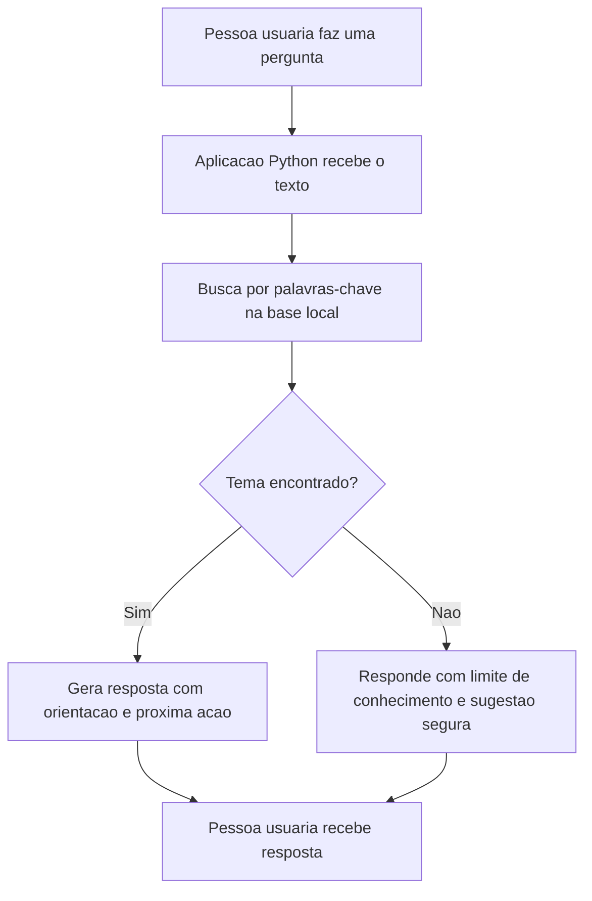

# Bia Financas Simples: Assistente Virtual com Inteligencia Artificial

Projeto desenvolvido para o lab **Construa Seu Assistente Virtual Com Inteligencia Artificial**, da DIO.

## Contexto

A **Bia Financas Simples** e um prototipo de assistente virtual voltado para pessoas que querem organizar melhor a vida financeira, mas ainda tem dificuldade com conceitos basicos como orcamento, reserva de emergencia, controle de gastos e priorizacao de dividas.

O projeto foi inspirado na proposta do repositorio base da DIO, que orienta a construcao de um agente com documentacao, base de conhecimento, prompts, aplicacao funcional, avaliacao e pitch.

## Problema

Muitas pessoas sabem que precisam controlar gastos, guardar dinheiro ou renegociar dividas, mas nao sabem por onde comecar. A falta de orientacao simples pode levar a decisoes impulsivas, atraso em pagamentos e dificuldade para criar uma rotina financeira saudavel.

## Solucao

A Bia responde perguntas simples usando uma base de conhecimento local. Ela busca informacoes organizadas sobre:

- Orcamento mensal
- Reserva de emergencia
- Dividas
- Cartao de credito
- Pix e seguranca
- Metas financeiras

Quando nao encontra informacao suficiente, o assistente informa a limitacao e sugere uma proxima acao segura.

## Publico-alvo

Pessoas iniciantes em educacao financeira que desejam receber orientacoes simples, praticas e sem linguagem complicada.

## O que o assistente faz

- Entende uma pergunta do usuario.
- Busca o tema mais relacionado na base de conhecimento.
- Responde com orientacao simples e objetiva.
- Evita prometer resultado financeiro.
- Recomenda procurar atendimento especializado quando a pergunta envolve risco, investimento ou situacao sensivel.

## O que o assistente nao faz

- Nao substitui consultoria financeira profissional.
- Nao recomenda produto financeiro especifico.
- Nao acessa dados bancarios reais.
- Nao inventa resposta quando nao ha informacao na base.
- Nao toma decisoes pelo usuario.

## Estrutura do projeto

```text
assistente-virtual-ia/
├── README.md
├── data/
│   ├── base_conhecimento.json
│   └── perguntas_teste.json
├── docs/
│   ├── 01-documentacao-agente.md
│   ├── 02-base-conhecimento.md
│   ├── 03-prompts.md
│   ├── 04-metricas.md
│   └── 05-pitch.md
├── src/
│   └── app.py
└── ENTREGA_DIO.md
```

## Como executar

Na raiz do repositorio, execute:

```bash
python assistente-virtual-ia/src/app.py
```

Tambem e possivel testar com uma pergunta direta:

```bash
python assistente-virtual-ia/src/app.py --pergunta "Como montar uma reserva de emergencia?"
```

Para rodar os cenarios de avaliacao:

```bash
python assistente-virtual-ia/src/app.py --avaliar
```

## Exemplos de perguntas

```text
Como comecar um orcamento mensal?
O que e reserva de emergencia?
Como priorizar minhas dividas?
Como evitar problemas com cartao de credito?
Como usar Pix com mais seguranca?
```

## Exemplo de resposta

```text
Tema identificado: reserva_emergencia
Confianca aproximada: 0.67

A reserva de emergencia e um dinheiro separado para imprevistos...

Proxima acao sugerida: defina uma meta inicial pequena, como guardar R$ 50 por mes.
```

## Arquitetura simples



## Avaliacao

O prototipo foi avaliado com perguntas de teste presentes em [data/perguntas_teste.json](data/perguntas_teste.json). Os criterios usados foram:

- Tema correto identificado.
- Resposta baseada na base de conhecimento.
- Clareza da orientacao.
- Presenca de uma proxima acao.
- Tratamento seguro quando a base nao possui informacao suficiente.

## Resultado

O projeto entrega uma primeira versao funcional de assistente virtual com IA simulada por regras e base de conhecimento local. Ele mostra o fluxo essencial de um agente: entender a pergunta, consultar conhecimento organizado, responder com seguranca e indicar uma proxima decisao.

## Referencias do desafio

- Repositorio base: https://github.com/digitalinnovationone/dio-lab-bia-do-futuro
- Repositorio de exemplo: https://github.com/falvojr/dio-lab-bia-do-futuro

